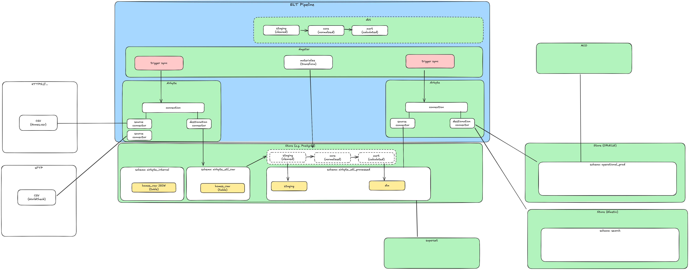

# MCO ETL Proof of Concept

This application is an ETL pipeline for MCO, implementing a data integration solution using Airbyte. The project serves as a proof of concept to evaluate Airbyte's capabilities for ingesting CSV data and loading it into an Oracle database.

## Project Objectives

- Evaluate modern ELT architecture for MCO's data integration needs
- Implement automated data ingestion from CSV sources using Airbyte
- Establish reliable data transformation pipeline with dbt
- Create proof of concept for Oracle database integration
- Provide comprehensive documentation and evaluation framework

## Background: Modern ELT Architecture

Modern data pipelines often follow the Extract-Load-Transform (ELT) pattern, which differs from traditional ETL in several key aspects:

1. **Data Loading**: Raw data is loaded directly into the target system before transformation, allowing for:

   - Preservation of source data integrity
   - Ability to reprocess data with different transformation logic
   - Reduced complexity in the extraction phase

2. **Transformation**: Transformations occur within the target database, leveraging:

   - Modern data warehouse computing power
   - SQL-based transformations for better accessibility
   - Version control and testing of transformation logic

3. **Modularity**: Each component is specialized and replaceable:
   - Extraction tools focus on source system connectivity
   - Loading ensures reliable data ingestion
   - Transformation tools handle data modeling and business logic

## Technology Choices

Our stack leverages best-in-class open-source tools for each component of the ELT pipeline:

### Airbyte (Extract & Load)

- Open-source data integration platform
- Rich ecosystem of pre-built connectors
- Handles incremental syncs and schema evolution
- Strong community support and regular updates

### Dagster (Orchestration)

- Modern orchestration framework with rich UI
- Asset-based paradigm for data dependencies
- Built-in testing and monitoring capabilities
- Excellent integration with dbt and other tools

### dbt (Transform)

- Industry standard for data transformation
- Version controlled SQL transformations
- Built-in testing and documentation
- Modular approach to data modeling

### PostgreSQL (Temporary Storage)

- Robust and well-understood database
- Compatible with both Airbyte and dbt
- Serving as a temporary replacement for Oracle
- Proven performance for analytical workloads

### Superset (Visualization)

- Feature-rich BI platform
- Self-service analytics capabilities
- Modern, interactive dashboards
- Strong SQL-first approach

## Stack

- Airbyte (Extract & Load)
- Dagster (Orchestration)
- dbt (Transform)
- PostgreSQL (Temporary storage, to be replaced with Oracle)
- Superset (Visualization)

## Architecture



## Setup

1. Clone the repository and navigate to the project directory

2. Make the setup script executable and run it:

   ```bash
   chmod +x setup.sh
   ./setup.sh
   ```

   Note: Initial build may take several minutes. Monitor the console for service readiness.

3. Once ready, access the following interfaces:
   - Dagster UI: [http://localhost:3000](http://localhost:3000)
   - Airbyte UI: [http://localhost:8000](http://localhost:8000)
   - Superset: [http://localhost:8088](http://localhost:8088)

## Development Workflow

1. **Data Source Configuration**

   - Configure CSV source connectors in Airbyte
   - Set up destination database connection
   - Define sync schedules and options

2. **Transformation Development**

   - Write and test dbt models
   - Define data quality tests
   - Document transformation logic

3. **Pipeline Orchestration**

   - Configure Dagster workflows
   - Set up dependencies between tasks
   - Monitor pipeline execution

4. **Data Visualization**
   - Create Superset dashboards
   - Set up automated reporting
   - Configure user access

## Monitoring and Maintenance

- Monitor pipeline health through Dagster UI
- Check data quality test results in dbt
- Review Airbyte sync logs
- Monitor system resource usage

## System Requirements

- [Docker](https://docs.docker.com/engine/install/)
- Minimum 32GB RAM (Airbyte and dbt operations are memory-intensive)
- Multi-core CPU recommended (8+ cores for optimal performance)
- 50GB free disk space for Docker images and data storage

## Future Considerations

1. **Production Deployment**

   - High availability setup
   - Backup and recovery procedures
   - Monitoring and alerting
   - Security hardening

2. **Oracle Integration**

   - Migration from PostgreSQL
   - Performance optimization
   - Security configuration
   - Backup strategies

3. **Scale Considerations**
   - Horizontal scaling options
   - Performance optimization
   - Resource management
   - Cost optimization

## Credits

This project serves as a proof of concept for MCO's ETL requirements.

Inspired by:

- [Build a poor man's data lake from scratch with DuckDB](https://dagster.io/blog/duckdb-data-lake)
- [Using dbt with Dagster software-defined assets](https://docs.dagster.io/integrations/dbt/using-dbt-with-dagster)
